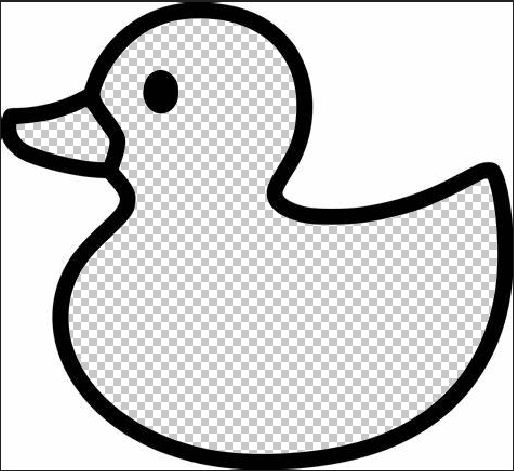
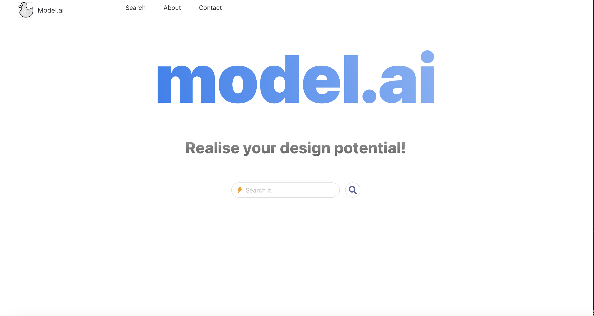
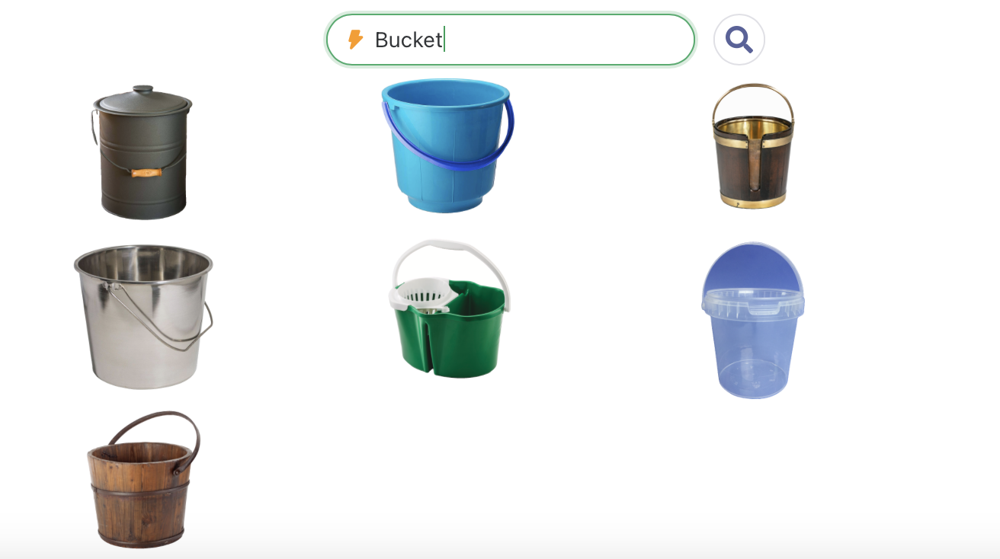

# AIfinity-2023
AIfinity 2023 - Team STEMazon

Submission for the [Aifinity 2023 Hackathon](https://aifinity-2023.devpost.com)

## About the project

In this AI era, people have been discovering more and more potential of AI as an assistant to our daily lives and work. Following this trend, our team (STEMazon) developed [Model.ai](https://devpost.com/software/stemazon-tba), an search-engine-like web application to generate relevant images without background based on user inputs as tags. Utilizing AWS cloud computing services, user input in the search box will be sent to the cloud where requests are sent to the search engine API for images. The iamges are processed at our backend deployed with AWS, and returned and displayed on the user webpages. With this service, our team aim to eliminate the repetitive processes of extracting the subject of the picture from a noisy image. The task that constantly bother designers, artists, marketing employees and all those who have presentation as part of their work. Now with Model.ai, you can choose from 8 options automatically cleaned for you using [U-Squared-Net](https://arxiv.org/pdf/2005.09007.pdf)-based models pretrained on large dataset.

<p align='center'>

</p>

## Tech Stack

AWS S3 Cloud Object Storage

AWS Lambda Serverless Computing

AWS SageMaker - the Machine Learning platform

Javascript (Vue.js 3.0 Framework)

Python (Flask Framework)

Python (Pytorch, Opencv, etc. for ML)

## Screenshots


 

## Get Started

Go to our [Model.ai](http://stemazon-s3.s3-website-ap-southeast-1.amazonaws.com) official website, enter the your search text and patiently wait for the images

## More Resources

## Future Prospect

* 2D image to label map generater + label map to 3D model generator = search-engine-like 3D model generator

## Citation

```
@InProceedings{Qin_2020_PR,
title = {U2-Net: Going Deeper with Nested U-Structure for Salient Object Detection},
author = {Qin, Xuebin and Zhang, Zichen and Huang, Chenyang and Dehghan, Masood and Zaiane, Osmar and Jagersand, Martin},
journal = {Pattern Recognition},
volume = {106},
pages = {107404},
year = {2020}
}
```